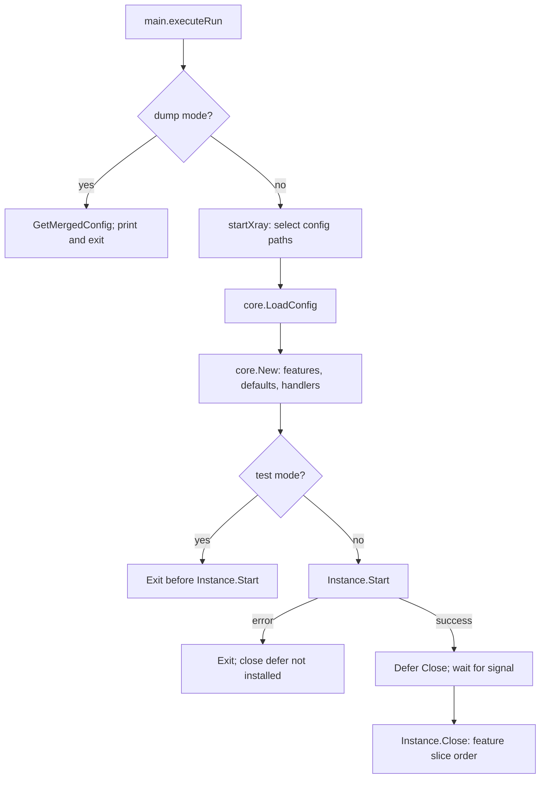
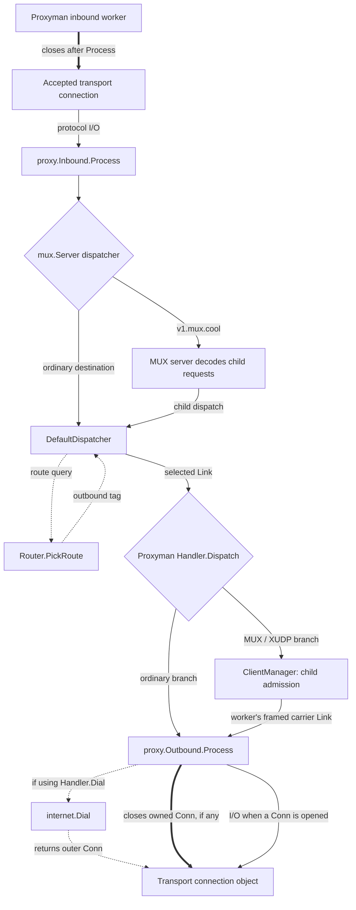
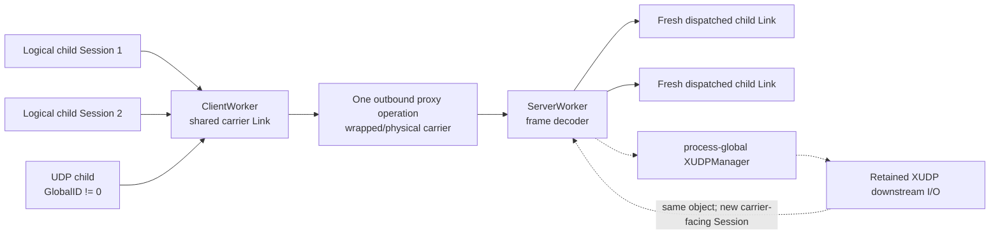
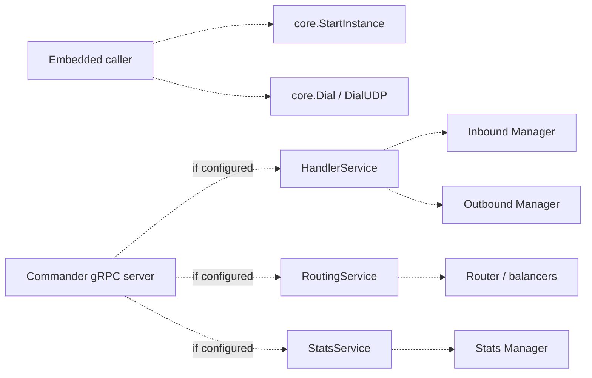

# Xray core atlas: preserved source map and E1 overlay

> This restores the full navigation map used in the research, rather than
> substituting the six E1 paths for the whole core. The body is pinned to
> official `dcdfc57c` (2026-09-19); it is **not** relabelled as an audit of every
> line at the newer E1 base `3519dfec`. For the implemented E1 changes, use
> [the current owner/retirement overlay](OWNERSHIP_MAP.md). The later-base
> corrections below are explicit; the original code links remain immutable.

## Later-base corrections and how to read this map

- E1 uses official `3519dfec`, not the atlas snapshot. FinalMask construction,
  transports, WireGuard, logging and MASQUE changed between these refs. The
  full intervening diff was inventoried, not exhaustively re-audited here.
- At E1's base, [ToMemoryStreamConfig](https://github.com/XTLS/Xray-core/blob/3519dfecbd65022ba71d9bc73e94063d0cbc8636/transport/internet/memory_settings.go)
  constructs FinalMask even with empty mask lists. An available nil bypass in
  a dialer does not establish that ordinary configuration takes that bypass.
  The older body's optional-mask descriptions must be read at its stated pin.
- [MASQUE outbound](https://github.com/XTLS/Xray-core/blob/3519dfecbd65022ba71d9bc73e94063d0cbc8636/proxy/masque/client.go)
  and [transport](https://github.com/XTLS/Xray-core/tree/3519dfecbd65022ba71d9bc73e94063d0cbc8636/transport/internet/masque)
  add CONNECT-IP/virtual packet ownership beyond the transport registry table
  in this earlier map. They have no E1 native migration claim.
- The E1 overlay modifies selected admission, prepared outbound, stream,
  association and native child owners. It does not alter every feature manager,
  pool, DNS client, virtual connection or retained XUDP owner mapped below.
- The close table describes method effects at the pinned source, not a security
  audit or a blanket promise of whole-runtime join. The map deliberately keeps
  logical flow, request, association, carrier and physical-resource identities
  separate. A common type name cannot collapse those lifetimes.

## Status and source boundary

This is a neutral navigation guide to existing official XTLS/Xray-core. It is
not a fork design, implementation plan, migration contract, task queue, or
statement of preferred architecture.

| Item | Value |
|---|---|
| Official repository | [XTLS/Xray-core](https://github.com/XTLS/Xray-core) |
| Examined commit | [`dcdfc57ccdad496e192344788a7d14a8d4c88573`](https://github.com/XTLS/Xray-core/commit/dcdfc57ccdad496e192344788a7d14a8d4c88573) |
| Commit date | 2026-09-19T09:03:11Z |
| Checked | 2026-09-20; source audit plus registration/caller cross-check of structural branches |

All source links below are pinned to the examined commit. The broad official
[design overview](https://xtls.github.io/en/development/intro/design.html)
describes application, proxy, and transport layers; the official
[working-principle page](https://xtls.github.io/en/document/level-1/work.html)
describes inbound to dispatcher to routed outbound flow. This atlas adds code
owners, call boundaries, data shapes, and lifecycle detail from the source. It
does not restate configuration documentation or enumerate every protocol and
cryptographic operation.

The separate [related-work note](MIGRATION.md) describes open
proposals. Nothing from that overlay is part of the as-is diagrams below.

The diagrams describe call and data boundaries, not a guarantee that every
operation completes, every error propagates through its return value, or every
object named `Conn` owns an independent socket. The tables below distinguish
those cases directly from the pinned implementation.

The structural cross-check starts at registrations and production callers, not
at test coverage: config/feature construction, inbound admission,
`Dispatch`/`DispatchLink`, outbound handoff, dial/listen registries, internal
traffic, and control services. Families sharing a handoff are grouped; named
bypass and reinjection branches are kept explicit. This is a navigation map,
not an enumeration of every packet value, interleaving, or cryptographic step.

## Repository map

| Area | Existing responsibility at this snapshot |
|---|---|
| `main/` | CLI commands, config-path selection, process startup, signal wait, API client commands, and distro imports |
| `infra/conf/` | JSON/YAML/TOML models, ordered config merging, validation, and conversion to typed `core.Config` messages |
| `core/` | `Instance`, feature construction/dependency resolution, handler creation, embedded `Dial`/`DialUDP`, start, and close |
| `features/` | Stable feature-facing interfaces for routing, DNS, inbound/outbound managers, policy, and statistics |
| `app/` | Application features: dispatcher, router, DNS, proxyman managers, stats, commander/API, observatory, and related services |
| `proxy/` | Inbound and outbound protocol implementations plus TUN, loopback, Freedom, WireGuard, DNS outbound, and protocol framing |
| `transport/` | `Link`, in-memory pipe, Internet dial/listen registries, socket controls, security/transport wrappers, and concrete transports |
| `common/` | Shared buffers, sessions, MUX/XUDP, virtual connection adapters, signals, errors, protocol helpers, and utilities |

`transport.Link` is the central logical bridge: it is a `buf.Reader` plus a
`buf.Writer`, not a socket and not a universal lifecycle owner. See
[`transport/link.go`](https://github.com/XTLS/Xray-core/blob/dcdfc57ccdad496e192344788a7d14a8d4c88573/transport/link.go#L5-L9).

## Startup, configuration, and feature lifecycle

The executable path is
[`executeRun`](https://github.com/XTLS/Xray-core/blob/dcdfc57ccdad496e192344788a7d14a8d4c88573/main/run.go#L74-L109)
to
[`startXray`](https://github.com/XTLS/Xray-core/blob/dcdfc57ccdad496e192344788a7d14a8d4c88573/main/run.go#L208-L229).
Config paths come from a valid CLI configuration directory (otherwise the
environment directory), accumulated explicit/directory files, conventional
configuration filenames in the working directory, the environment config path,
or finally stdin; see
[`getConfigFilePath`](https://github.com/XTLS/Xray-core/blob/dcdfc57ccdad496e192344788a7d14a8d4c88573/main/run.go#L149-L205).
For a file-list input, `core.LoadConfig` determines each format: one protobuf
file uses its loader, a protobuf/multiple-file combination is rejected, and
non-protobuf lists use `ConfigBuilderForFiles`. An `io.Reader` input instead
uses its named registered loader. Text configs are decoded and overlaid in order by
[`mergeConfigs`](https://github.com/XTLS/Xray-core/blob/dcdfc57ccdad496e192344788a7d14a8d4c88573/infra/conf/serial/builder.go#L36-L67).
[`Config.Build`](https://github.com/XTLS/Xray-core/blob/dcdfc57ccdad496e192344788a7d14a8d4c88573/infra/conf/xray.go#L528-L685)
creates the default dispatcher and inbound/outbound managers, appends configured
features, and builds typed handler configs. Package imports in
[`main/distro/all/all.go`](https://github.com/XTLS/Xray-core/blob/dcdfc57ccdad496e192344788a7d14a8d4c88573/main/distro/all/all.go)
activate config, proxy, and transport registrations through `init` functions.

`core.Instance` owns a feature slice, pending typed dependency callbacks, a
running flag, and its context. During
[`initInstanceWithConfig`](https://github.com/XTLS/Xray-core/blob/dcdfc57ccdad496e192344788a7d14a8d4c88573/core/xray.go#L189-L252),
configured apps are created first; missing DNS, policy, router, and stats
features receive defaults; unresolved mandatory `RequireFeatures` callbacks
block construction, while optional callbacks do not. Inbound handlers are
added before outbound handlers. Configuration-only `--test` still constructs
these objects, but does not call `Instance.Start`; `--dump` does not construct
an Instance. The startup diagram is not a reverse-order rollback guarantee.

| Operation | Actual behavior |
|---|---|
| `RequireFeatures` | Resolves callback parameter types against registered features or queues the callback until dependencies appear. |
| `AddFeature` before start | Appends the feature and rechecks queued dependency callbacks. |
| `AddFeature` while running | Calls the new feature's `Start` without appending it to the feature slice or resolving pending dependencies. A start error is logged; this branch still returns `nil`. |
| `Instance.Start` | Sets `running` before calling `Start` in feature-slice order and returns the first error without rollback. Source comments say instance state is unknown after a start error. |
| `Instance.Close` | Clears `running`, calls every feature's `Close` in feature-slice order, and combines errors. It is not a generic context cancel, reverse-order unwind, timeout, or whole-runtime join. |

Sources: [`Instance`, `RequireFeatures`, `AddFeature`, `Start`, and `Close`](https://github.com/XTLS/Xray-core/blob/dcdfc57ccdad496e192344788a7d14a8d4c88573/core/xray.go#L81-L400).

## Main execution path: data, control, and ownership

Solid arrows show data-bearing handoffs or I/O, not a count of copies or
goroutines. Dashed arrows show calls/results; thick arrows show who closes
the named outer object. Return traffic uses the corresponding reverse I/O.
This diagram covers listener-based proxyman admission and the built-in
proxyman outbound handler. TUN/WireGuard stack admission and special handlers
are described separately below; not every flow traverses a TCP listener.
The dial/connection segment is conditional: a
[`blackhole outbound`](https://github.com/XTLS/Xray-core/blob/dcdfc57ccdad496e192344788a7d14a8d4c88573/proxy/blackhole/blackhole.go#L58-L81)
handles the link without dialing, and loopback re-enters dispatch with the same
link. Selecting an outbound does not by itself imply opening or owning a Conn.
Configured VLESS/Trojan fallbacks also leave the shown path before dispatcher
admission; their direct relay is listed under special branches.

The inbound manager owns inbound handlers. An
[`AlwaysOnInboundHandler`](https://github.com/XTLS/Xray-core/blob/dcdfc57ccdad496e192344788a7d14a8d4c88573/app/proxyman/inbound/always.go#L46-L200)
owns its protocol proxy, TCP/UDP/Unix workers, and its MUX-aware dispatcher
wrapper. A TCP worker attaches source/local/tag/content metadata, calls
`proxy.Inbound.Process`, then cancels and closes the accepted connection in
[`tcpWorker.callback`](https://github.com/XTLS/Xray-core/blob/dcdfc57ccdad496e192344788a7d14a8d4c88573/app/proxyman/inbound/worker.go#L61-L128).

Inbound protocol code implements
[`proxy.Inbound`](https://github.com/XTLS/Xray-core/blob/dcdfc57ccdad496e192344788a7d14a8d4c88573/proxy/proxy.go#L61-L68)
and may dispatch a decoded request. Proxyman workers receive the MUX-aware
dispatcher: ordinary destinations pass through, while `v1.mux.cool` is handled
as a carrier and decoded children enter the underlying dispatcher. The selected
outbound is an `outbound.Handler`; it need not be the proxyman implementation.
The ordinary proxyman branch calls its protocol-specific
[`proxy.Outbound.Process`](https://github.com/XTLS/Xray-core/blob/dcdfc57ccdad496e192344788a7d14a8d4c88573/proxy/proxy.go#L70-L74).
The proxyman handler owns sender/stream settings, the proxy object, MUX/XUDP
manager references and outbound counters. Its other branches submit the child
link to MUX/XUDP; a worker calls the outbound proxy for a separate framed carrier
operation. Its `Dial` method delegates to `internet.Dial`. Special reverse
handlers have their own `Dispatch` path rather than this exact branch structure.

`internet.Dial` selects the configured transport dialer for TCP; for UDP it
selects the registered `udp` dialer regardless of the TCP stream protocol name.
It returns the dialer's result rather than retaining a new universal close owner.
For the plain TCP dialer, the order is `DialSystem`, optional TCP FinalMask,
TLS/uTLS or REALITY, then optional TCP header authentication. For the UDP dialer,
it is `DialSystem` followed by an optional UDP mask. Other transport dialers
compose their own wrappers, pools or virtual streams; these are not all layers
applied by the generic `internet.Dial` function.

Sources: [`internet.Dial`](https://github.com/XTLS/Xray-core/blob/dcdfc57ccdad496e192344788a7d14a8d4c88573/transport/internet/dialer.go#L47-L74),
[`TCP dial`](https://github.com/XTLS/Xray-core/blob/dcdfc57ccdad496e192344788a7d14a8d4c88573/transport/internet/tcp/dialer.go#L20-L116),
[`UDP dial`](https://github.com/XTLS/Xray-core/blob/dcdfc57ccdad496e192344788a7d14a8d4c88573/transport/internet/udp/dialer.go#L15-L53).
The selected handler, outer connection, lower pooled carrier, terminal physical
egress and bytes on the wire are therefore not interchangeable facts.

### Transport registration and listener handoff

[`transportDialerCache`](https://github.com/XTLS/Xray-core/blob/dcdfc57ccdad496e192344788a7d14a8d4c88573/transport/internet/dialer.go#L36-L74)
and [`transportListenerCache`](https://github.com/XTLS/Xray-core/blob/dcdfc57ccdad496e192344788a7d14a8d4c88573/transport/internet/tcp_hub.go#L11-L81)
select concrete functions by transport name. The registered families in this
source tree are:

| Registry name / source | Dial | Listener and admission shape |
|---|---|---|
| [`tcp`](https://github.com/XTLS/Xray-core/tree/dcdfc57ccdad496e192344788a7d14a8d4c88573/transport/internet/tcp) | `Dial` | `ListenTCP`: accepted connection after configured wrappers |
| [`udp`](https://github.com/XTLS/Xray-core/tree/dcdfc57ccdad496e192344788a7d14a8d4c88573/transport/internet/udp) | Registered UDP dial function | No transport-listener registration; proxyman's UDP worker calls `udp.ListenUDP` directly |
| [`mkcp`](https://github.com/XTLS/Xray-core/tree/dcdfc57ccdad496e192344788a7d14a8d4c88573/transport/internet/kcp) | `DialKCP` | `ListenKCP`: KCP connection over packet I/O |
| [`websocket`](https://github.com/XTLS/Xray-core/tree/dcdfc57ccdad496e192344788a7d14a8d4c88573/transport/internet/websocket) | `Dial` | `ListenWS`: upgraded WebSocket stream |
| [`httpupgrade`](https://github.com/XTLS/Xray-core/tree/dcdfc57ccdad496e192344788a7d14a8d4c88573/transport/internet/httpupgrade) | `Dial` | `ListenHTTPUpgrade`: upgraded stream |
| [`grpc`](https://github.com/XTLS/Xray-core/tree/dcdfc57ccdad496e192344788a7d14a8d4c88573/transport/internet/grpc) | `Dial` | `Listen`: per-RPC virtual connection |
| [`splithttp`](https://github.com/XTLS/Xray-core/tree/dcdfc57ccdad496e192344788a7d14a8d4c88573/transport/internet/splithttp) | `Dial` | `ListenXH`: logical stream assembled from HTTP requests |
| [`hysteria`](https://github.com/XTLS/Xray-core/tree/dcdfc57ccdad496e192344788a7d14a8d4c88573/transport/internet/hysteria) | `Dial` | `Listen`: authenticated stream/UDP-session handoff over QUIC |
| [`xdrive`](https://github.com/XTLS/Xray-core/tree/dcdfc57ccdad496e192344788a7d14a8d4c88573/transport/internet/xdrive) | `Dial` | `Serve`: storage-backed session connection |

These transport listeners invoke `ConnHandler` with their concrete connection;
proxyman passes its TCP/Unix worker callback, which then calls the inbound
protocol. `ListenTCP` is therefore a registry entry point, not a promise that
every callback owns a new physical TCP socket. Ordinary proxyman UDP follows
the separate packet-hub callback. See
[`worker wiring`](https://github.com/XTLS/Xray-core/blob/dcdfc57ccdad496e192344788a7d14a8d4c88573/app/proxyman/inbound/worker.go),
[`UDP hub`](https://github.com/XTLS/Xray-core/blob/dcdfc57ccdad496e192344788a7d14a8d4c88573/transport/internet/udp/hub.go),
and the concrete transport directories above. TLS/REALITY and FinalMask are
wrappers/security facilities, not additional entries in this dial/listen table.

Below transport selection, the terminal system dialer is replaceable through
[`UseAlternativeSystemDialer` / `WithAdapter`](https://github.com/XTLS/Xray-core/blob/dcdfc57ccdad496e192344788a7d14a8d4c88573/transport/internet/system_dialer.go#L169-L220).
This is an embedding seam; no production in-tree caller selects an alternative
at this snapshot. Dialer-controller callbacks apply to the default dialer;
when `AutoOutboundsInterface` is non-empty, the TUN handler registers one for
socket routing/interface handling.
[`System listeners`](https://github.com/XTLS/Xray-core/blob/dcdfc57ccdad496e192344788a7d14a8d4c88573/transport/internet/system_listener.go)
have separate listener-controller callbacks. These controls do not add a
logical-flow dispatcher or turn a virtual Conn into a physical socket.

## `Dispatch` and `DispatchLink`

| Property | `Dispatch(ctx, destination)` | `DispatchLink(ctx, destination, link)` |
|---|---|---|
| Input data path | No existing link | Caller supplies a link |
| Link construction | Creates two crossed `transport/pipe` pairs | Reuses caller link; wraps reader/writer for timeout and user stats |
| Returned value | Returns the inbound-facing link before routing completes | Returns only an error; the shown implementation directly rejects an invalid destination but otherwise returns `nil` after its routing path |
| Routing execution | Starts sniffing/routing in a goroutine and returns | Sniffing/routing runs in the caller goroutine |
| Physical connection ownership | None implied by the returned logical link | Remains with the caller or lower concrete path; dispatcher does not acquire a universal socket owner role |
| Completion meaning | Return means the logical link was created, not that routing/dial/relay succeeded | The direct proxyman branch waits for `proxy.Process`; a MUX/XUDP branch follows child admission/context/session timing. Neither return is a whole-flow completion receipt |

Source: [`DefaultDispatcher.getLink`, `Dispatch`, and `DispatchLink`](https://github.com/XTLS/Xray-core/blob/dcdfc57ccdad496e192344788a7d14a8d4c88573/app/dispatcher/default.go#L140-L376).

Missing routes/tags and outbound errors can be logged, submitted through
`session.SubmitOutboundErrorToOriginator`, or represented by closing/interrupting
link endpoints without becoming a non-nil `DispatchLink` result. In the MUX
client, a pipe-backed reader returns after worker admission; a non-pipe reader
waits for context or session completion. See
[`Handler.Dispatch`](https://github.com/XTLS/Xray-core/blob/dcdfc57ccdad496e192344788a7d14a8d4c88573/app/proxyman/outbound/handler.go#L177-L260)
and [`ClientWorker.Dispatch`](https://github.com/XTLS/Xray-core/blob/dcdfc57ccdad496e192344788a7d14a8d4c88573/common/mux/client.go#L311-L330).

### Existing admission families

| Caller family | Handoff at this snapshot | Source entry points |
|---|---|---|
| SOCKS TCP, HTTP CONNECT, Dokodemo, ordinary VLESS and Hysteria | Caller supplies `DispatchLink`; protocol parsing and retained/decoded I/O remain in the inbound. | [SOCKS](https://github.com/XTLS/Xray-core/blob/dcdfc57ccdad496e192344788a7d14a8d4c88573/proxy/socks/server.go#L118-L165), [HTTP CONNECT](https://github.com/XTLS/Xray-core/blob/dcdfc57ccdad496e192344788a7d14a8d4c88573/proxy/http/server.go#L172-L203), [Dokodemo](https://github.com/XTLS/Xray-core/blob/dcdfc57ccdad496e192344788a7d14a8d4c88573/proxy/dokodemo/dokodemo.go#L153-L201), [VLESS](https://github.com/XTLS/Xray-core/blob/dcdfc57ccdad496e192344788a7d14a8d4c88573/proxy/vless/inbound/inbound.go#L625-L641), [Hysteria](https://github.com/XTLS/Xray-core/blob/dcdfc57ccdad496e192344788a7d14a8d4c88573/proxy/hysteria/server.go#L86-L170) |
| Plain HTTP requests, VMess, Trojan and classic Shadowsocks TCP | `Dispatch` creates the paired pipes; the caller separately transfers protocol data. One HTTP keep-alive connection can serve multiple routed requests. | [HTTP requests](https://github.com/XTLS/Xray-core/blob/dcdfc57ccdad496e192344788a7d14a8d4c88573/proxy/http/server.go#L208-L272), [VMess](https://github.com/XTLS/Xray-core/blob/dcdfc57ccdad496e192344788a7d14a8d4c88573/proxy/vmess/inbound/inbound.go#L227-L319), [Trojan](https://github.com/XTLS/Xray-core/blob/dcdfc57ccdad496e192344788a7d14a8d4c88573/proxy/trojan/server.go#L323-L359), [Shadowsocks](https://github.com/XTLS/Xray-core/blob/dcdfc57ccdad496e192344788a7d14a8d4c88573/proxy/shadowsocks/server.go#L200-L260) |
| Shadowsocks 2022 single/multi/relay callbacks | Their actual TCP/packet callbacks use link-creating `Dispatch` and sing-bridge copying. The existence of a separate sing-bridge `DispatchLink` helper does not change those callers. | [Single](https://github.com/XTLS/Xray-core/blob/dcdfc57ccdad496e192344788a7d14a8d4c88573/proxy/shadowsocks_2022/inbound.go#L113-L153), [multi](https://github.com/XTLS/Xray-core/blob/dcdfc57ccdad496e192344788a7d14a8d4c88573/proxy/shadowsocks_2022/inbound_multi.go#L234-L275), [relay](https://github.com/XTLS/Xray-core/blob/dcdfc57ccdad496e192344788a7d14a8d4c88573/proxy/shadowsocks_2022/inbound_relay.go#L136-L179) |
| TUN and WireGuard stack flows | Stack/listener callbacks supply `DispatchLink`; they do not originate in the proxyman TCP worker shown above. | [TUN](https://github.com/XTLS/Xray-core/blob/dcdfc57ccdad496e192344788a7d14a8d4c88573/proxy/tun/handler.go#L176-L242), [WireGuard](https://github.com/XTLS/Xray-core/blob/dcdfc57ccdad496e192344788a7d14a8d4c88573/proxy/wireguard/server.go#L329-L385) |
| SOCKS, classic Shadowsocks and Trojan UDP | A protocol-local UDP dispatcher lazily obtains and reuses a routed Link; packet destinations remain in buffers. | [UDP dispatcher](https://github.com/XTLS/Xray-core/blob/dcdfc57ccdad496e192344788a7d14a8d4c88573/transport/internet/udp/dispatcher.go#L71-L160) |
| Decoded MUX children | A NEW child obtains a fresh dispatched Link, except for retained-XUDP rebinding. Carrier admission is not child admission. | [MUX server](https://github.com/XTLS/Xray-core/blob/dcdfc57ccdad496e192344788a7d14a8d4c88573/common/mux/server.go#L165-L285) |

Embedded `core.Dial`, routed DNS, tagged dial and redispatch also reach these
interfaces. A call to `Dispatch` or `DispatchLink` alone therefore identifies
neither a physical accept nor USER origin; see the special branches below.

### Sniffing and handler selection

Both dispatch forms populate `session.Outbound.OriginalTarget` and `Target`.
When sniffing is enabled, a `cachedReader` preserves consumed bytes while
metadata and payload sniffers inspect the request. A permitted result can
replace the target or set only `RouteTarget`, depending on `routeOnly`, FakeDNS,
and protocol settings. The built-in sniffer set includes TCP HTTP/TLS/BitTorrent,
UDP QUIC/uTP, and optional FakeDNS metadata paths.

[`routedDispatch`](https://github.com/XTLS/Xray-core/blob/dcdfc57ccdad496e192344788a7d14a8d4c88573/app/dispatcher/default.go#L434-L505)
selects in this order:

1. a forced outbound tag stored in the context;
2. `Router.PickRoute` and its returned outbound tag;
3. the outbound manager's default handler.

A missing explicitly forced or routed tag closes/interrupts the link; it does
not silently use the default. The selected handler tag is stored in the current
`session.Outbound`, then `handler.Dispatch` receives the link.

Routing inputs come from the
[`session routing adapter`](https://github.com/XTLS/Xray-core/blob/dcdfc57ccdad496e192344788a7d14a8d4c88573/features/routing/session/context.go):
inbound source/local/tag/user, outbound target/route target, and sniffed content.
The configured
[`process matcher`](https://github.com/XTLS/Xray-core/blob/dcdfc57ccdad496e192344788a7d14a8d4c88573/app/router/condition.go#L293-L397)
additionally calls platform `net.FindProcess` using endpoint metadata and
matches process name/path or Xray itself. It returns false when lookup fails;
this is local process routing, not remote application identity. On Android,
[`RegisterAndroidProcessFinder`](https://github.com/XTLS/Xray-core/blob/dcdfc57ccdad496e192344788a7d14a8d4c88573/common/net/find_process_android.go#L9-L20)
must supply the lookup callback. This native branch does not imply that the
host application has already integrated that callback.

For a balancing rule, `Rule.GetTag` calls `Balancer.PickOutbound`: the outbound
manager supplies candidate tags, then override/strategy/fallback handling
produces a tag or an error. Least-ping/least-load consume Observatory results;
random/round-robin also consult Observatory when configured with a fallback
tag. These are route-selection dependencies, not data relays. See
[`rule and strategy construction`](https://github.com/XTLS/Xray-core/blob/dcdfc57ccdad496e192344788a7d14a8d4c88573/app/router/config.go),
[`balancer`](https://github.com/XTLS/Xray-core/blob/dcdfc57ccdad496e192344788a7d14a8d4c88573/app/router/balancing.go),
[`least-ping`](https://github.com/XTLS/Xray-core/blob/dcdfc57ccdad496e192344788a7d14a8d4c88573/app/router/strategy_leastping.go),
[`least-load`](https://github.com/XTLS/Xray-core/blob/dcdfc57ccdad496e192344788a7d14a8d4c88573/app/router/strategy_leastload.go),
and [`random`](https://github.com/XTLS/Xray-core/blob/dcdfc57ccdad496e192344788a7d14a8d4c88573/app/router/strategy_random.go).

A configured rule webhook is another outgoing branch:
[`Router.PickRoute`](https://github.com/XTLS/Xray-core/blob/dcdfc57ccdad496e192344788a7d14a8d4c88573/app/router/router.go#L53-L69)
calls `WebhookNotifier.Fire` after obtaining the rule's tag, before dispatcher
handler lookup or outbound execution. The notifier sends an asynchronous HTTP
POST through its own Go HTTP client (or a Unix-socket transport), not Xray
dispatch. Optional per-email deduplication can suppress events. `TestRoute`
also calls `PickRoute`, so it can trigger this webhook without user traffic;
forced-tag and default-fallback dispatch do not produce a matched-rule webhook.
This is a route-decision event, not successful connection/byte/close telemetry.
The dispatcher separately records an attached access message, including detour,
before invoking the chosen handler. See
[`webhook`](https://github.com/XTLS/Xray-core/blob/dcdfc57ccdad496e192344788a7d14a8d4c88573/app/router/webhook.go#L48-L235),
[`TestRoute`](https://github.com/XTLS/Xray-core/blob/dcdfc57ccdad496e192344788a7d14a8d4c88573/app/router/command/command.go#L92-L105),
and [`access-log handoff`](https://github.com/XTLS/Xray-core/blob/dcdfc57ccdad496e192344788a7d14a8d4c88573/app/dispatcher/default.go#L486-L504).

### Router and DNS interaction

The configured `app/router.Router` stores rules and balancers behind atomic pointers and applies rules
in order. `IpOnDemand` wraps the routing context with the built-in DNS client
before evaluation. `IpIfNonMatch` first evaluates without DNS, then resolves and
retries if the target is a domain. `SkipDNSResolve` prevents this branch and is
used by internal paths to avoid resolution loops. See
[`Router.PickRoute` and `pickRouteInternal`](https://github.com/XTLS/Xray-core/blob/dcdfc57ccdad496e192344788a7d14a8d4c88573/app/router/router.go#L53-L219)
and
[`ResolvableContext`](https://github.com/XTLS/Xray-core/blob/dcdfc57ccdad496e192344788a7d14a8d4c88573/features/routing/dns/context.go#L12-L56).

When those features are absent, `core.New` supplies `routing.DefaultRouter` and
`localdns.Client`, not an empty configured router/DNS state with identical behavior.
See [`default feature injection`](https://github.com/XTLS/Xray-core/blob/dcdfc57ccdad496e192344788a7d14a8d4c88573/core/xray.go#L212-L228).

The configured `app/dns.DNS` feature owns hosts, nameserver clients, selection
rules, fallback behavior, and query strategy. `LookupIP` checks static hosts and
then the selected clients. Routed UDP nameservers use an internal UDP dispatcher;
routed TCP/DoH use `Dispatcher.Dispatch` and adapt the returned link to a virtual
connection. Local modes call local/system networking instead. The DNS feature's
`Start` and `Close` methods are no-ops at this snapshot. Its client/server objects
can retain cache state, a UDP dispatcher and periodic cleanup, a pooled DoH
HTTP/2 transport, or a reusable QUIC connection. There is no DNS-feature-wide
close/drain barrier; any later self-retirement is specific to the lower object.
See [`DNS feature lifecycle`](https://github.com/XTLS/Xray-core/blob/dcdfc57ccdad496e192344788a7d14a8d4c88573/app/dns/dns.go#L191-L199),
[`UDP server state`](https://github.com/XTLS/Xray-core/blob/dcdfc57ccdad496e192344788a7d14a8d4c88573/app/dns/nameserver_udp.go#L23-L59),
[`DoH transport`](https://github.com/XTLS/Xray-core/blob/dcdfc57ccdad496e192344788a7d14a8d4c88573/app/dns/nameserver_doh.go#L39-L111),
and [`QUIC reuse`](https://github.com/XTLS/Xray-core/blob/dcdfc57ccdad496e192344788a7d14a8d4c88573/app/dns/nameserver_quic.go#L217-L277).

The complete nameserver-family switch is
[`NewServer`](https://github.com/XTLS/Xray-core/blob/dcdfc57ccdad496e192344788a7d14a8d4c88573/app/dns/nameserver.go#L47-L99):
classic UDP and `tcp`/`https`/`h2c` are routed; `localhost`,
`tcp+local`, `https+local`, `h2c+local`, and `quic+local` do not use the supplied
dispatcher; `fakedns` allocates synthetic answers from the FakeDNS feature.
FakeDNS is a two-way metadata path: DNS query -> pool mapping -> synthetic IP;
later dispatcher sniffing -> reverse lookup -> domain used by target/route
override rules. It is not a network connection to the synthetic address. See
[`FakeDNS answer`](https://github.com/XTLS/Xray-core/blob/dcdfc57ccdad496e192344788a7d14a8d4c88573/app/dns/nameserver_fakedns.go),
[`pool owner`](https://github.com/XTLS/Xray-core/blob/dcdfc57ccdad496e192344788a7d14a8d4c88573/app/dns/fakedns/fake.go),
and [`reverse sniffer`](https://github.com/XTLS/Xray-core/blob/dcdfc57ccdad496e192344788a7d14a8d4c88573/app/dispatcher/fakednssniffer.go#L16-L54).

The separate DNS **outbound** consumes DNS messages from an already selected
Link. Its rule actions are drop, return a local answer, hijack A/AAAA via
`dns.Client.LookupIP`, or forward through a lazily dialed connection. Links
recognized as the DNS client's own queries bypass hijacking and are forwarded.
Thus a DNS outbound need not dial for every request, and a hijacked query can
create a separate internal DNS dispatch. See
[`DNS outbound branches`](https://github.com/XTLS/Xray-core/blob/dcdfc57ccdad496e192344788a7d14a8d4c88573/proxy/dns/dns.go#L141-L340).

## TCP, packet/UDP, TUN, MUX, and retained XUDP

| Shape | Admission and transfer | Destination representation | Local owner |
|---|---|---|---|
| Ordinary routed TCP relay | Listener accepts a `stat.Connection`; inbound proxy dispatches a logical link; a dialing outbound relays both directions. Protocol fallbacks and non-dialing outbounds are separate branches below. | One stream target in session metadata. | Inbound worker owns accepted connection; a dialing outbound owns its connection for that operation. |
| Ordinary UDP listener | UDP worker creates/reuses a virtual `udpConn` over pipes and callbacks. | Association key uses source and, when not cone, destination; individual buffers can still carry `Buffer.UDP`. | UDP worker owns hub and active-association map; each `udpConn.Close` cancels and closes its pipe writer. |
| Routed `DialUDP` | `udp.dispatcherConn` implements `net.PacketConn` over a lazily created, reusable routed link and a bounded response channel; a later packet can create another link after termination. | `WriteTo` sets `Buffer.UDP`; `ReadFrom` returns the packet source. | `dispatcherConn.Close` closes only its done marker. Internal inactivity/`RemoveRay` cancels and interrupts the current routed link. |
| TUN TCP | TUN device and IP stack produce a virtual `net.Conn`; handler converts it to a supplied link and uses `DispatchLink`. | Destination comes from the IP stack. | TUN handler defers virtual-connection close; stack and TUN device are closed separately. |
| TUN UDP/full-cone | One source-keyed virtual association can carry packets for successive destinations. | Each packet's current destination is retained in `Buffer.UDP`. | TUN UDP connection handler/association, not one object per destination. |
| MUX child | `Session` has a worker-local 16-bit ID, input/output, transfer type, and close state. | New/keep frames encode child target; packet frames can carry later UDP destinations. | `SessionManager` of one client/server worker. |
| MUX carrier | One `ClientWorker.link` carries framed data for many child sessions through one outbound proxy operation. | Carrier target is the MUX sentinel; child targets live in frames. | Client/server worker owns carrier link and session manager. |
| Retained XUDP | Nonzero `GlobalID` maps to a process-global `XUDP` containing downstream I/O and a current carrier-facing `Session`; a later carrier session can rebind to the same object. | Global ID correlates retained UDP state; it is not a universal logical-flow identity or authorization token. | `XUDPManager.Map` retains the object across rebinding; expiry or specific dispatch failure removes it. Closing the carrier-facing session intentionally preserves retained downstream I/O. |

### MUX and XUDP ownership

Client-side construction and framing are in
[`common/mux/client.go`](https://github.com/XTLS/Xray-core/blob/dcdfc57ccdad496e192344788a7d14a8d4c88573/common/mux/client.go#L25-L331).
Server-side frame admission, child dispatch, and XUDP rebinding are in
[`common/mux/server.go`](https://github.com/XTLS/Xray-core/blob/dcdfc57ccdad496e192344788a7d14a8d4c88573/common/mux/server.go#L87-L330).
`Session.Close` interrupts/closes ordinary child endpoints. For a session with
retained server-side XUDP state it instead stops the current handler, marks the
retained object expiring, and leaves downstream I/O available for rebinding.
The expiry timestamp is one minute later; actual retirement occurs when the
periodic manager checks it, not as a synchronous one-minute close promise. See
[`Session` and `XUDPManager`](https://github.com/XTLS/Xray-core/blob/dcdfc57ccdad496e192344788a7d14a8d4c88573/common/mux/session.go#L156-L251).

Closing a child, closing a carrier worker, retiring retained XUDP, and closing a
physical socket are therefore different events. `SessionID` is worker-local;
`GlobalID` is XUDP correlation; neither is a universal durable connection ID.

## Internal reinjection and special branches

| Branch | Existing path | What it changes |
|---|---|---|
| Loopback outbound | [`proxy/loopback.Process`](https://github.com/XTLS/Xray-core/blob/dcdfc57ccdad496e192344788a7d14a8d4c88573/proxy/loopback/loopback.go#L22-L50) calls `DispatchLink` with the same link. | Replaces inbound tag/content context and re-enters dispatch; no physical socket is implied. |
| VLESS/Trojan inbound fallback | Configured fallback branches use ordinary `net.Dialer.DialContext` and bidirectional `buf.Copy`, optionally adding a PROXY header: [VLESS](https://github.com/XTLS/Xray-core/blob/dcdfc57ccdad496e192344788a7d14a8d4c88573/proxy/vless/inbound/inbound.go#L304-L510), [Trojan](https://github.com/XTLS/Xray-core/blob/dcdfc57ccdad496e192344788a7d14a8d4c88573/proxy/trojan/server.go#L364-L545). | The fallback leg bypasses Xray dispatcher, outbound manager and `internet.Dial`; the inbound method closes its fallback connection. If its destination is another Xray inbound, that listener starts a separate admission. |
| `dialerProxy` | [`DialSystem`](https://github.com/XTLS/Xray-core/blob/dcdfc57ccdad496e192344788a7d14a8d4c88573/transport/internet/dialer.go#L225-L287) finds the named outbound. `redirect` appends session outbound metadata, creates crossed pipes and starts that handler in a goroutine with `context.WithoutCancel`. | Returns a virtual connection immediately. This is direct named-handler reinjection, not another router choice; closing the virtual connection closes its local endpoints, not a universal worker join. |
| Tagged dial | [`DialTaggedOutbound`](https://github.com/XTLS/Xray-core/blob/dcdfc57ccdad496e192344788a7d14a8d4c88573/transport/internet/tagged/taggedimpl/impl.go#L15-L40) stores a forced tag, dispatches, and adapts the link to `net.Conn`. | Bypasses normal router choice for the next dispatch only. |
| Internal DNS | Routed UDP/TCP/DoH use the dispatcher; local/system variants bypass it. Context flags and configured tags participate in route/DNS handling. | DNS query traffic can have its own links/outbounds; the presence of a tag alone is not a general recursion or origin guarantee. |
| WireGuard outbound peer transport | [`Handler.init`](https://github.com/XTLS/Xray-core/blob/dcdfc57ccdad496e192344788a7d14a8d4c88573/proxy/wireguard/client.go#L280-L328) calls `internet.DialSystem` directly, adapts packet I/O, and applies its UDP mask and optional packet counters. | Bypasses `Handler.Dial` and the transport dialer registry, but can still traverse `DialSystem`'s `dialerProxy` branch. Its peer transport is distinct from inner routed stack flows. |
| VLESS reverse | VLESS inbound/outbound create reverse handlers and reuse `reverse` MUX bridge/portal primitives. | `BridgeWorker` forwards non-internal children to dispatcher but consumes control destinations locally; Portal sends user/control children through MUX workers. The legacy top-level `reverse` JSON field is rejected by `Config.Build`. |
| Commander API outbound | Without a direct listen address, Commander inserts a special outbound whose accepted virtual connections feed gRPC. | API data reaches gRPC through the normal outbound manager rather than a separate direct listener. |

Do not confuse the surviving typed `OutboundHandlerConfig.proxy_settings`
(protocol config instantiated by the handler) with legacy JSON outbound
`proxySettings` (a removed chaining setting).
[`OutboundDetourConfig.Build`](https://github.com/XTLS/Xray-core/blob/dcdfc57ccdad496e192344788a7d14a8d4c88573/infra/conf/xray.go#L259-L263)
rejects the latter and points to `streamSettings.sockopt.dialerProxy`; it is not
another reachable detour path at this snapshot.

## Connection forms: logical, virtual, and physical

| Form | File / symbol | Meaning and limit |
|---|---|---|
| Logical link | `transport.Link` | Buffer reader/writer pair between handlers; no address, deadline, or universal close receipt. |
| In-memory link endpoints | `transport/pipe.Reader` / `Writer` | Local buffered handoff with backpressure, close, interrupt, and optional overflow discard. A successful nonempty write normally enqueues data; configured overflow discard can also return `nil` after releasing it. |
| Virtual stream `net.Conn` | [`common/net/cnc.Connection`](https://github.com/XTLS/Xray-core/blob/dcdfc57ccdad496e192344788a7d14a8d4c88573/common/net/cnc/connection.go#L13-L159) | Adapts link-style I/O to `net.Conn`; default addresses are synthetic but options can set them. Deadline setters are no-ops. `Write` returns the full input length alongside the lower `WriteMultiBuffer` error, so its `n` is not an independently measured accepted prefix. |
| Virtual dispatcher `net.PacketConn` | [`udp.dispatcherConn`](https://github.com/XTLS/Xray-core/blob/dcdfc57ccdad496e192344788a7d14a8d4c88573/transport/internet/udp/dispatcher.go#L165-L251) | Response queue capacity is 16; excess callback packets are released. Deadlines are no-ops and `Close` only closes a done marker. `WriteTo` copies at most one `buf.Size`, dispatches without a returned downstream error, and returns copied `n, nil`. |
| Sing bridge stream | [`singbridge.Conn`](https://github.com/XTLS/Xray-core/blob/dcdfc57ccdad496e192344788a7d14a8d4c88573/common/singbridge/reader.go#L19-L65) / [`PipeConnWrapper`](https://github.com/XTLS/Xray-core/blob/dcdfc57ccdad496e192344788a7d14a8d4c88573/common/singbridge/pipe.go#L16-L80) | `Conn` embeds an existing `net.Conn`; its vector fallback ignores each lower returned `n`. `PipeConnWrapper.Write` reports all-or-zero around an error-only buffer writer; its `Close` is a no-op. |
| Sing bridge packet | [`singbridge.PacketConnWrapper`](https://github.com/XTLS/Xray-core/blob/dcdfc57ccdad496e192344788a7d14a8d4c88573/common/singbridge/packet.go#L17-L106) | Preserves each packet destination through `Buffer.UDP`; `Close` releases cached buffers, not the embedded connection/reader/writer. |
| TUN virtual stream/packet | gVisor/sing stack connection handed to `tun.Handler` | Represents an IP-stack flow or association, not a physical Internet socket. |
| MUX child | `mux.Session` | Logical stream/packet child of a shared carrier, identified only within that worker. |
| gRPC RPC connection | [`grpc.Dial`](https://github.com/XTLS/Xray-core/blob/dcdfc57ccdad496e192344788a7d14a8d4c88573/transport/internet/grpc/dial.go#L46-L90) and Hunk connection encoding | Per-RPC virtual `cnc.Connection` over a cached/reused `grpc.ClientConn`. Closing the RPC stream does not establish closure of that shared channel. |
| SplitHTTP/XHTTP stream | [`splitConn`](https://github.com/XTLS/Xray-core/blob/dcdfc57ccdad496e192344788a7d14a8d4c88573/transport/internet/splithttp/connection.go#L12-L63) | Reader/writer and request cancellation over HTTP; deadlines are no-ops. Closing the stream is distinct from retiring Xmux/HTTP clients and upload pools. |
| XDRIVE stream | [`xdrive.Conn`](https://github.com/XTLS/Xray-core/blob/dcdfc57ccdad496e192344788a7d14a8d4c88573/transport/internet/xdrive/conn.go#L12-L138) | WAL/storage-backed virtual stream with placeholder addresses and local deadline behavior; no `DialSystem` socket per logical stream. |
| Other wrapped transport connection | TLS/REALITY/FinalMask/WebSocket/Hysteria/KCP and other concrete wrappers | May wrap, share or replace lower resources; a `net.Conn` interface alone does not identify the physical carrier owner. |
| Physical/system connection | `DefaultSystemDialer.Dial` result or transport-owned lower connection | Ordinary system socket seam, though higher layers may wrap, share, or replace it. |
| Counter wrapper | `stat.CounterConnection` | Counts the lower returned `n`, including alongside an error; its numbers inherit that connection's semantics. It does not generically forward optional concrete interfaces such as `syscall.Conn` or half-close. |

Default system UDP opens an unconnected packet socket and presents it through
`PacketConnWrapper`, whose stream-style `Write` uses its stored destination.
The UDP mask path accepts either that wrapper or a virtual `cnc.Connection`,
adapted by `FakePacketConn`; the latter's `WriteTo` ignores its address argument
and uses the underlying stream destination. UDP-hop can change the remote
address and, when local hopping is enabled, call `DialSystem` again to replace
the packet connection. Thus one outer packet facade need not imply one fixed
lower socket. Sources:
[`system UDP and adapters`](https://github.com/XTLS/Xray-core/blob/dcdfc57ccdad496e192344788a7d14a8d4c88573/transport/internet/system_dialer.go),
[`UDP mask handoff`](https://github.com/XTLS/Xray-core/blob/dcdfc57ccdad496e192344788a7d14a8d4c88573/transport/internet/udp/dialer.go#L22-L49),
[`UDP-hop redial`](https://github.com/XTLS/Xray-core/blob/dcdfc57ccdad496e192344788a7d14a8d4c88573/transport/internet/finalmask/udphop/conn.go#L96-L143).

## Byte accounting and fast-path boundaries

The source contains several different byte facts. They must not be collapsed
into one "traffic bytes" meaning.

| Seam | What the source proves | What it does not prove |
|---|---|---|
| `dispatcher.SizeStatWriter.WriteMultiBuffer` | Adds `mb.Len()` before the lower writer call: logical bytes offered to the next writer. | Successful lower acceptance, physical write, encryption overhead, or remote receipt. |
| `buf.Copy` `CountSize` / `AddToStatCounter` | Counts buffers after read and before `writer.WriteMultiBuffer`. | Accepted prefix when the lower write fails. |
| `pipe.WriteMultiBuffer` | A nonempty successful enqueue appends buffers and signals the reader. With `discardOverflow`, a full pipe instead releases the buffers and returns `nil`; an empty input also succeeds without enqueue. | `nil` alone does not prove enqueue, socket acceptance or remote delivery. |
| `TimeoutWrapperReader` | Counts the buffer length returned by the wrapped reader. | Where those bytes originated below the reader. |
| `stat.CounterConnection` | Counts `n` returned by the wrapped `Read` or `Write`. | Remote receipt or a universal payload/ciphertext interpretation. |
| WireGuard `PacketCounterConnection.ReadFrom` / `WriteTo` | Count the returned `n` at that concrete packet connection when the operation has no error. | Other UDP paths or end-to-end delivery. |
| TUN TCP counter | Counts virtual gVisor connection I/O. | TUN frame bytes or terminal egress bytes. |
| TUN UDP downlink writer | Counts each packet only after its lower `WriteMultiBuffer` succeeds. | Physical network delivery. |
| `ReadVReader` | Counts returned buffer lengths; its initial one-buffer path uses ordinary reading, while the multi-buffer path uses raw vector I/O. | That every call used `readv`/`WSARecv`, remote delivery, or payload size after decoding. |
| `BufferToBytesWriter.WriteMultiBuffer` | Scalar/vector paths accumulate lower returned `n`, including on error, in their configured counter. | Its separate `ReadFrom` return uses pre-write `CountSize`; that return can exceed lower accepted bytes on write error. No universal syscall or remote-receipt guarantee follows. |
| Vision direct writer | When its direct counter is active, adds input `mb.Len()` before filtering/padding and the lower write. | Partial-write-safe acceptance receipt. |
| Vision direct reader | Counts buffers already read from the unwrapped connection. | A universal ciphertext boundary; prior Vision processing can unpad/filter. |
| Linux/Android splice | Final `*net.TCPConn.ReadFrom` returns a total `w`; counters add it even when an error is also returned. | Per-chunk logical progress while splice is active, or remote receipt. |

Relevant sources:

- [`SizeStatWriter`](https://github.com/XTLS/Xray-core/blob/dcdfc57ccdad496e192344788a7d14a8d4c88573/app/dispatcher/stats.go#L9-L25)
- [`buf.Copy`](https://github.com/XTLS/Xray-core/blob/dcdfc57ccdad496e192344788a7d14a8d4c88573/common/buf/copy.go#L18-L120)
- [`ReadVReader`](https://github.com/XTLS/Xray-core/blob/dcdfc57ccdad496e192344788a7d14a8d4c88573/common/buf/readv_reader.go#L53-L145)
- [`BufferToBytesWriter`](https://github.com/XTLS/Xray-core/blob/dcdfc57ccdad496e192344788a7d14a8d4c88573/common/buf/writer.go#L13-L72)
- [WireGuard `PacketCounterConnection`](https://github.com/XTLS/Xray-core/blob/dcdfc57ccdad496e192344788a7d14a8d4c88573/proxy/wireguard/client.go#L505-L524)
- [`VisionReader` / `VisionWriter`](https://github.com/XTLS/Xray-core/blob/dcdfc57ccdad496e192344788a7d14a8d4c88573/proxy/proxy.go#L174-L403)
- [`CopyRawConnIfExist`](https://github.com/XTLS/Xray-core/blob/dcdfc57ccdad496e192344788a7d14a8d4c88573/proxy/proxy.go#L715-L799)

`net.Buffers.WriteTo` establishes vector output at the Go API boundary. The
Xray source alone does not prove that every platform/runtime invocation becomes
one `writev` syscall. Likewise, no universal counter for ciphertext-on-wire or
remote application acceptance exists at this snapshot.

Counter-wrapper transparency is path-specific. `buf.NewWriter` explicitly
unwraps an exact `CounterConnection` for vector selection. `buf.NewReader`
checks `syscall.Conn` before its special counter extraction, so a wrapper that
hides that interface does not automatically retain raw-read eligibility.
Raw-copy helpers have their own unwrapping logic. See
[`reader/writer factories`](https://github.com/XTLS/Xray-core/blob/dcdfc57ccdad496e192344788a7d14a8d4c88573/common/buf/io.go#L111-L195).

## Control and API entry points

| Entry point | Actual owner/action |
|---|---|
| `core.StartInstance` | Loads serialized config, constructs `Instance`, and starts it. On a start error it returns `nil, err` without calling `Close` on the partially started instance. |
| `core.Dial` | Calls the registered dispatcher and adapts its returned link to virtual `net.Conn`. |
| `core.DialUDP` | Returns a virtual dispatcher-backed `net.PacketConn`. |
| `core.AddInboundHandler` / `AddOutboundHandler` | Construct a typed handler and add it to its manager. A running manager inserts the handler before calling `Start`; a start error does not roll back that insertion. |
| HandlerService | Add/remove/list handlers; built-in inbound alterations include `AddUser`/`RemoveUser`. The `AlterOutbound` interface exists, but no concrete outbound operation implementation was found in this tree. Inbound removal closes then removes; outbound removal only deletes manager references. |
| RoutingService | Test routes, add/remove/list rules, inspect or override balancer targets. The registered Commander service has a nil routing-statistics channel: `SubscribeRoutingStats` returns "Routing statistics not enabled", and `TestRoute.PublishResult` publishes nothing. The subscription method exists but is not wired to a live source in this registration. |
| StatsService | Read/reset named counters, query counters, online maps, and process statistics. |
| LoggerService / ObservatoryService / ReflectionService | Configured auxiliary services: restart the logger, retrieve the active Observatory feature's results, or expose gRPC service descriptors. They do not add per-flow lifecycle control. |
| Commander | Registers only configured services; listens directly on TCP/Unix or inserts an API outbound. `Close` stops/clears the gRPC server but does not explicitly remove that API outbound from its manager. |

Sources: [`core/functions.go`](https://github.com/XTLS/Xray-core/blob/dcdfc57ccdad496e192344788a7d14a8d4c88573/core/functions.go#L24-L83),
[`app/commander/commander.go`](https://github.com/XTLS/Xray-core/blob/dcdfc57ccdad496e192344788a7d14a8d4c88573/app/commander/commander.go#L28-L128),
[`app/proxyman/command/command.go`](https://github.com/XTLS/Xray-core/blob/dcdfc57ccdad496e192344788a7d14a8d4c88573/app/proxyman/command/command.go#L67-L221), and
[`app/router/command/command.go`](https://github.com/XTLS/Xray-core/blob/dcdfc57ccdad496e192344788a7d14a8d4c88573/app/router/command/command.go#L15-L155).

There is no stock connection-list/close service in the examined commit. Open PR
#5844 is described only in the separate proposal overlay.

The distinction between a declared API and an active data source is visible in
[`routingServer.SubscribeRoutingStats` and `service.Register`](https://github.com/XTLS/Xray-core/blob/dcdfc57ccdad496e192344788a7d14a8d4c88573/app/router/command/command.go#L107-L153).
`TestRoute` evaluates a supplied routing context; it is not a subscription to
real dispatched traffic and does not establish that a network connection ran.
The separately configured rule webhook described above is not this nil channel;
`TestRoute` can still trigger that rule-side effect. Auxiliary service owners are
[`LoggerServer`](https://github.com/XTLS/Xray-core/blob/dcdfc57ccdad496e192344788a7d14a8d4c88573/app/log/command/command.go),
[`ObservatoryService`](https://github.com/XTLS/Xray-core/blob/dcdfc57ccdad496e192344788a7d14a8d4c88573/app/observatory/command/command.go),
and [`reflection registration`](https://github.com/XTLS/Xray-core/blob/dcdfc57ccdad496e192344788a7d14a8d4c88573/app/commander/service.go).

Commander is added only when API configuration exists; service names select
the registered implementations, and unknown service strings are omitted by
[`APIConfig.Build`](https://github.com/XTLS/Xray-core/blob/dcdfc57ccdad496e192344788a7d14a8d4c88573/infra/conf/api.go#L16-L49).
`AddRule(shouldAppend=false)` replaces the rule/balancer sets; `true` preserves
and appends them. Dynamic outbound removal returns success for a nonempty tag
even when it was absent. These native results are not a general transactional
or traffic-delivery contract. See
[`ReloadRules`](https://github.com/XTLS/Xray-core/blob/dcdfc57ccdad496e192344788a7d14a8d4c88573/app/router/router.go#L82-L149)
and [`outbound manager mutation`](https://github.com/XTLS/Xray-core/blob/dcdfc57ccdad496e192344788a7d14a8d4c88573/app/proxyman/outbound/outbound.go#L102-L146).

### Other application services

These are existing services adjacent to the main path, not a second connection
tracking API:

| Service | Existing behavior and navigation |
|---|---|
| Policy | [`ForLevel` / `ForSystem`](https://github.com/XTLS/Xray-core/blob/dcdfc57ccdad496e192344788a7d14a8d4c88573/app/policy/manager.go#L39-L62) supply session timeout/buffer/statistics settings and system policy; feature start/close are no-ops. |
| Logging | [`log.Instance.Handle`](https://github.com/XTLS/Xray-core/blob/dcdfc57ccdad496e192344788a7d14a8d4c88573/app/log/log.go#L107-L159) routes access, DNS and general messages to configured loggers and filters general severity. Its feature owns logger setup/closure, not connection ownership. |
| Metrics | [`MetricsHandler`](https://github.com/XTLS/Xray-core/blob/dcdfc57ccdad496e192344788a7d14a8d4c88573/app/metrics/metrics.go#L52-L117) serves HTTP through a direct listener and/or special outbound. Its HTTP handler exposes debug variables, statistics, observatory status and pprof; close closes its listeners and removes its tagged handler. |
| Observatory | [`Observer.Start` / `Close`](https://github.com/XTLS/Xray-core/blob/dcdfc57ccdad496e192344788a7d14a8d4c88573/app/observatory/observer.go#L41-L64) start configured background probing and signal it to stop. [`probe`](https://github.com/XTLS/Xray-core/blob/dcdfc57ccdad496e192344788a7d14a8d4c88573/app/observatory/observer.go#L136-L205) uses tagged dispatch and an HTTP request; the result is an active observation, not per-flow passive statistics. |
| Stats channels | [`Channel`](https://github.com/XTLS/Xray-core/blob/dcdfc57ccdad496e192344788a7d14a8d4c88573/app/stats/channel.go#L69-L173) supports blocking/nonblocking publishing. The nonblocking fallback starts sending goroutines when a channel is full; it is not a drop-on-overflow bounded event log. |
| Burst Observatory | [`burst.Observer`](https://github.com/XTLS/Xray-core/blob/dcdfc57ccdad496e192344788a7d14a8d4c88573/app/observatory/burst/burstobserver.go) implements the same Observatory feature with scheduled sample groups. Its [`ping client`](https://github.com/XTLS/Xray-core/blob/dcdfc57ccdad496e192344788a7d14a8d4c88573/app/observatory/burst/ping.go) uses tagged dispatch for selected handlers and a separate ordinary HTTP client for direct connectivity checks. Results feed Observatory consumers, including balancers/API/metrics. |
| Geodata | [`Instance`](https://github.com/XTLS/Xray-core/blob/dcdfc57ccdad496e192344788a7d14a8d4c88573/app/geodata/geodata.go#L24-L128) schedules registry reloads and optional asset updates. Its [`downloader`](https://github.com/XTLS/Xray-core/blob/dcdfc57ccdad496e192344788a7d14a8d4c88573/app/geodata/download.go#L58-L133) uses tagged dispatch, so it creates internal routed traffic without a user inbound. Reload targets shared IP/domain matcher registries, not a router replacement. `Close` stops cron and waits for its jobs. |

## Actual close owners

| Scope | Existing close owner and effect |
|---|---|
| Process | `executeRun` defers `server.Close` after `Instance.Start`, then waits for interrupt/SIGTERM. No shutdown deadline is present. |
| Instance | Calls all registered feature `Close` methods and combines errors. |
| Inbound manager | Dynamic removal closes the selected handler under the manager lock, logs/suppresses a close error, then removes it. Manager close invokes close on all current handlers. |
| Inbound handler | Invokes close on workers, MUX server and proxy. `mux.Server.Close` itself is a no-op and has no retained worker collection to shut down. |
| TCP worker | Closes listener hub; each callback cancels and closes its accepted connection after `proxy.Process`. |
| UDP worker | Closes hub, periodic checker, and proxy. Its shown `Close` does not explicitly iterate the active-association map. |
| Routed UDP facade | `dispatcherConn.Close` closes its done marker only; `connEntry.terminate`, reached through inactivity or `RemoveRay`, separately cancels and interrupts the routed Link. |
| TUN handler | Closes the IP stack and TUN device; each `HandleConnection` separately defers virtual connection close. |
| Dispatcher | `DefaultDispatcher.Close` is a no-op; individual link endpoints are closed/interrupted by path owners. |
| Outbound manager | Full manager close calls every handler `Close`. Dynamic `RemoveHandler` deletes the tagged entry and may clear the default pointer, but does not call `handler.Close`. |
| Outbound handler | Calls `common.Close(h.mux)`, but `ClientManager` does not implement `Close`, so that call does not close its workers; the handler then closes its proxy. `h.xudp` is not referenced by this method. Workers can still self-retire through their own monitor logic. |
| MUX worker | `Close` closes its `done`; monitor then closes sessions and interrupts carrier link ends. `WaitClosed` is a worker marker, not remote-delivery proof. |
| MUX child | Ordinary `Session.Close` interrupts input and closes output; retained XUDP follows the separate expiring/rebinding path. |
| Reverse primitives | [`Bridge.Close`](https://github.com/XTLS/Xray-core/blob/dcdfc57ccdad496e192344788a7d14a8d4c88573/app/reverse/bridge.go#L89-L99) stops its monitor, without iterating retained workers. [`Portal.Close`](https://github.com/XTLS/Xray-core/blob/dcdfc57ccdad496e192344788a7d14a8d4c88573/app/reverse/portal.go#L56-L65) removes the manager entry; the portal's outbound `Close` is a no-op. These methods are not aggregate reverse-worker shutdown. |
| DNS feature | Feature `Close` is a no-op, not a recursive close of retained nameserver caches, transports, reusable connections or workers. Those concrete lifetimes are separate. |
| Router | Closes webhook notifiers under its rule lock. |
| Commander | Stops/clears its gRPC server without explicitly removing its API outbound registration. |
| Concrete listener/connection | `Close` acts according to the concrete implementation: it can close a stream/request, release cached buffers, signal local work, or close a socket. A shared lower pool/channel or remote application need not end with that outer object. |

The source therefore uses delegated, capability-specific close ownership. It
does not expose a universal synchronous seal/join receipt for the whole runtime,
all MUX children, retained XUDP, remote peers, and physical transports.
For example, [`task.Run`](https://github.com/XTLS/Xray-core/blob/dcdfc57ccdad496e192344788a7d14a8d4c88573/common/task/task.go#L19-L63)
returns on the first error or cancellation without waiting for every sibling;
[`mux.Server.Close`](https://github.com/XTLS/Xray-core/blob/dcdfc57ccdad496e192344788a7d14a8d4c88573/common/mux/server.go#L77-L85)
does nothing. A method name or a marker by itself is not a stronger lifetime fact.

## File → symbol → responsibility index

| File | Symbol(s) | Navigation responsibility |
|---|---|---|
| [`main/run.go`](https://github.com/XTLS/Xray-core/blob/dcdfc57ccdad496e192344788a7d14a8d4c88573/main/run.go#L74-L229) | `executeRun`, `startXray` | Load, construct, start, signal wait, close |
| [`core/config.go`](https://github.com/XTLS/Xray-core/blob/dcdfc57ccdad496e192344788a7d14a8d4c88573/core/config.go#L16-L190) | `RegisterConfigLoader`, `LoadConfig` | Format registry and config loading |
| [`infra/conf/serial/builder.go`](https://github.com/XTLS/Xray-core/blob/dcdfc57ccdad496e192344788a7d14a8d4c88573/infra/conf/serial/builder.go#L24-L79) | `mergeConfigs`, `BuildConfig` | Ordered text-config decode/merge/build |
| [`infra/conf/xray.go`](https://github.com/XTLS/Xray-core/blob/dcdfc57ccdad496e192344788a7d14a8d4c88573/infra/conf/xray.go#L528-L685) | `Config.Build` | Typed feature and handler configuration |
| [`core/xray.go`](https://github.com/XTLS/Xray-core/blob/dcdfc57ccdad496e192344788a7d14a8d4c88573/core/xray.go#L81-L400) | `Instance`, `New`, `AddFeature`, `RequireFeatures`, `Start`, `Close` | Feature container and lifecycle |
| [`core/functions.go`](https://github.com/XTLS/Xray-core/blob/dcdfc57ccdad496e192344788a7d14a8d4c88573/core/functions.go#L15-L84) | `CreateObject`, `StartInstance`, `Dial`, `DialUDP` | Embedded entry points and virtual connections |
| [`features/routing/dispatcher.go`](https://github.com/XTLS/Xray-core/blob/dcdfc57ccdad496e192344788a7d14a8d4c88573/features/routing/dispatcher.go#L11-L28) | `Dispatcher` | Dispatch contract |
| [`app/dispatcher/default.go`](https://github.com/XTLS/Xray-core/blob/dcdfc57ccdad496e192344788a7d14a8d4c88573/app/dispatcher/default.go#L100-L505) | `getLink`, `Dispatch`, `DispatchLink`, `routedDispatch` | Logical links, sniffing, route/handler selection |
| [`app/dispatcher/sniffer.go`](https://github.com/XTLS/Xray-core/blob/dcdfc57ccdad496e192344788a7d14a8d4c88573/app/dispatcher/sniffer.go#L36-L132) | `Sniffer` | Metadata and content protocol detection |
| [`features/routing/router.go`](https://github.com/XTLS/Xray-core/blob/dcdfc57ccdad496e192344788a7d14a8d4c88573/features/routing/router.go#L9-L43) | `Router`, `Route` | Route-control interface |
| [`app/router/router.go`](https://github.com/XTLS/Xray-core/blob/dcdfc57ccdad496e192344788a7d14a8d4c88573/app/router/router.go#L19-L272) | `Router`, `PickRoute`, `ReloadRules` | Rule evaluation, DNS strategy, balancers |
| [`app/dns/dns.go`](https://github.com/XTLS/Xray-core/blob/dcdfc57ccdad496e192344788a7d14a8d4c88573/app/dns/dns.go#L42-L230) | `DNS`, `LookupIP`, `IsOwnLink` | Built-in DNS selection and lookup |
| [`app/dns/nameserver_udp.go`](https://github.com/XTLS/Xray-core/blob/dcdfc57ccdad496e192344788a7d14a8d4c88573/app/dns/nameserver_udp.go#L23-L199) | `ClassicNameServer` | Routed UDP DNS and cache |
| [`app/dns/nameserver_tcp.go`](https://github.com/XTLS/Xray-core/blob/dcdfc57ccdad496e192344788a7d14a8d4c88573/app/dns/nameserver_tcp.go#L23-L247) | `TCPNameServer` | Routed or local TCP DNS |
| [`proxy/dns/dns.go`](https://github.com/XTLS/Xray-core/blob/dcdfc57ccdad496e192344788a7d14a8d4c88573/proxy/dns/dns.go#L71-L340) | `Handler.Process` | DNS outbound/hijack and direct forwarding |
| [`features/inbound/inbound.go`](https://github.com/XTLS/Xray-core/blob/dcdfc57ccdad496e192344788a7d14a8d4c88573/features/inbound/inbound.go#L11-L46) | `Handler`, `Manager` | Inbound control contracts |
| [`app/proxyman/inbound/inbound.go`](https://github.com/XTLS/Xray-core/blob/dcdfc57ccdad496e192344788a7d14a8d4c88573/app/proxyman/inbound/inbound.go#L17-L190) | `Manager`, `NewHandler` | Inbound handler registry |
| [`app/proxyman/inbound/always.go`](https://github.com/XTLS/Xray-core/blob/dcdfc57ccdad496e192344788a7d14a8d4c88573/app/proxyman/inbound/always.go#L46-L221) | `AlwaysOnInboundHandler` | Proxy, workers, MUX dispatcher, start/close |
| [`app/proxyman/inbound/worker.go`](https://github.com/XTLS/Xray-core/blob/dcdfc57ccdad496e192344788a7d14a8d4c88573/app/proxyman/inbound/worker.go) | `tcpWorker`, `udpWorker`, `udpConn` | Listener callbacks and accepted associations |
| [`features/outbound/outbound.go`](https://github.com/XTLS/Xray-core/blob/dcdfc57ccdad496e192344788a7d14a8d4c88573/features/outbound/outbound.go#L12-L51) | `Handler`, `Manager` | Outbound control contracts |
| [`app/proxyman/outbound/outbound.go`](https://github.com/XTLS/Xray-core/blob/dcdfc57ccdad496e192344788a7d14a8d4c88573/app/proxyman/outbound/outbound.go#L16-L160) | `Manager` | Handler registry/default/removal/lifecycle |
| [`app/proxyman/outbound/handler.go`](https://github.com/XTLS/Xray-core/blob/dcdfc57ccdad496e192344788a7d14a8d4c88573/app/proxyman/outbound/handler.go#L56-L345) | `Handler.Dispatch`, `Dial`, `Close` | Target resolve, MUX/XUDP choice, proxy and physical dial |
| [`proxy/proxy.go`](https://github.com/XTLS/Xray-core/blob/dcdfc57ccdad496e192344788a7d14a8d4c88573/proxy/proxy.go#L61-L74) | `Inbound`, `Outbound` | Protocol-facing processing contracts |
| [`transport/link.go`](https://github.com/XTLS/Xray-core/blob/dcdfc57ccdad496e192344788a7d14a8d4c88573/transport/link.go#L5-L9) | `Link` | Logical reader/writer bridge |
| [`transport/pipe/impl.go`](https://github.com/XTLS/Xray-core/blob/dcdfc57ccdad496e192344788a7d14a8d4c88573/transport/pipe/impl.go#L23-L209) | `pipe` | Local buffering, backpressure, close, interrupt |
| [`transport/internet/dialer.go`](https://github.com/XTLS/Xray-core/blob/dcdfc57ccdad496e192344788a7d14a8d4c88573/transport/internet/dialer.go#L24-L287) | `Dial`, `DialSystem` | Transport selection, DNS strategy, dialerProxy |
| [`transport/internet/system_dialer.go`](https://github.com/XTLS/Xray-core/blob/dcdfc57ccdad496e192344788a7d14a8d4c88573/transport/internet/system_dialer.go#L22-L145) | `DefaultSystemDialer.Dial` | Ordinary system TCP/UDP socket creation |
| [`transport/internet/stat/connection.go`](https://github.com/XTLS/Xray-core/blob/dcdfc57ccdad496e192344788a7d14a8d4c88573/transport/internet/stat/connection.go#L9-L43) | `Connection`, `CounterConnection` | `net.Conn` type and lower returned-`n` counters |
| [`common/net/cnc/connection.go`](https://github.com/XTLS/Xray-core/blob/dcdfc57ccdad496e192344788a7d14a8d4c88573/common/net/cnc/connection.go#L13-L159) | `Connection` | Virtual `net.Conn` over buf I/O |
| [`transport/internet/udp/dispatcher.go`](https://github.com/XTLS/Xray-core/blob/dcdfc57ccdad496e192344788a7d14a8d4c88573/transport/internet/udp/dispatcher.go#L23-L251) | `Dispatcher`, `dispatcherConn` | Routed UDP association and virtual `PacketConn` |
| [`proxy/tun/handler.go`](https://github.com/XTLS/Xray-core/blob/dcdfc57ccdad496e192344788a7d14a8d4c88573/proxy/tun/handler.go#L26-L269) | `Handler.Start`, `HandleConnection`, `Close` | TUN device/stack setup and dispatch handoff |
| [`proxy/tun/udp_fullcone.go`](https://github.com/XTLS/Xray-core/blob/dcdfc57ccdad496e192344788a7d14a8d4c88573/proxy/tun/udp_fullcone.go#L19-L167) | `udpConnectionHandler`, `udpConn` | Source-keyed multi-destination TUN UDP |
| [`common/mux/client.go`](https://github.com/XTLS/Xray-core/blob/dcdfc57ccdad496e192344788a7d14a8d4c88573/common/mux/client.go#L25-L360) | `ClientManager`, `ClientWorker` | Carrier creation, child admission, framing |
| [`common/mux/server.go`](https://github.com/XTLS/Xray-core/blob/dcdfc57ccdad496e192344788a7d14a8d4c88573/common/mux/server.go#L22-L330) | `Server`, `ServerWorker` | Carrier decoding, child dispatch, XUDP attach |
| [`common/mux/session.go`](https://github.com/XTLS/Xray-core/blob/dcdfc57ccdad496e192344788a7d14a8d4c88573/common/mux/session.go#L19-L251) | `SessionManager`, `Session`, `XUDPManager` | Child identity/close and retained XUDP state |
| [`proxy/loopback/loopback.go`](https://github.com/XTLS/Xray-core/blob/dcdfc57ccdad496e192344788a7d14a8d4c88573/proxy/loopback/loopback.go#L16-L73) | `Loopback.Process` | Same-link redispatch |
| [`app/reverse/bridge.go`](https://github.com/XTLS/Xray-core/blob/dcdfc57ccdad496e192344788a7d14a8d4c88573/app/reverse/bridge.go#L19-L234) | `Bridge`, `BridgeWorker` | Reverse-side MUX server/control workers and dispatcher reinjection |
| [`app/reverse/portal.go`](https://github.com/XTLS/Xray-core/blob/dcdfc57ccdad496e192344788a7d14a8d4c88573/app/reverse/portal.go#L23-L307) | `Portal`, `PortalWorker` | Reverse-side MUX client/control worker primitives |
| [`app/commander/commander.go`](https://github.com/XTLS/Xray-core/blob/dcdfc57ccdad496e192344788a7d14a8d4c88573/app/commander/commander.go#L20-L134) | `Commander` | gRPC service registration/listening/stop |
| [`app/proxyman/command/command.go`](https://github.com/XTLS/Xray-core/blob/dcdfc57ccdad496e192344788a7d14a8d4c88573/app/proxyman/command/command.go#L67-L225) | `handlerServer` | Handler and inbound-user control API |
| [`app/router/command/command.go`](https://github.com/XTLS/Xray-core/blob/dcdfc57ccdad496e192344788a7d14a8d4c88573/app/router/command/command.go#L15-L155) | `routingServer` | Route/rule/balancer API |
| [`app/stats/command/command.go`](https://github.com/XTLS/Xray-core/blob/dcdfc57ccdad496e192344788a7d14a8d4c88573/app/stats/command/command.go#L18-L224) | `statsServer` | Counter, online-map, and system stats API |
| [`common/session/session.go`](https://github.com/XTLS/Xray-core/blob/dcdfc57ccdad496e192344788a7d14a8d4c88573/common/session/session.go) | `Inbound`, `Outbound`, `Content` | Request/routing metadata, distinct from I/O ownership |
| [`common/task/task.go`](https://github.com/XTLS/Xray-core/blob/dcdfc57ccdad496e192344788a7d14a8d4c88573/common/task/task.go) | `Run`, `OnSuccess` | Parallel-task return and success-continuation behavior |
| [`app/policy/manager.go`](https://github.com/XTLS/Xray-core/blob/dcdfc57ccdad496e192344788a7d14a8d4c88573/app/policy/manager.go) | `ForLevel`, `ForSystem` | Session and system policy lookup |
| [`app/log/log.go`](https://github.com/XTLS/Xray-core/blob/dcdfc57ccdad496e192344788a7d14a8d4c88573/app/log/log.go) | `Instance.Handle`, `Start`, `Close` | Log filtering and logger ownership |
| [`app/metrics/metrics.go`](https://github.com/XTLS/Xray-core/blob/dcdfc57ccdad496e192344788a7d14a8d4c88573/app/metrics/metrics.go) | `MetricsHandler`, `httpHandler` | HTTP debug/statistics/observatory surface |
| [`app/observatory/observer.go`](https://github.com/XTLS/Xray-core/blob/dcdfc57ccdad496e192344788a7d14a8d4c88573/app/observatory/observer.go) | `Observer`, `background`, `probe` | Configured active probing through tagged dispatch |

## Deliberately unexamined or bounded details

- Every protocol's authentication, framing, encryption, copy-loop, and close
  behavior was not expanded line by line. VLESS/Vision and Freedom were used as
  representative fast-path and direct-outbound navigation points.
- Every concrete transport's internal lifecycle was not exhaustively traced.
  Registry/dial/listen ownership, plain TCP/UDP ordering, gRPC per-RPC versus
  shared-channel boundaries, SplitHTTP stream versus pool boundaries, and the
  XDRIVE connection facade were examined. Dependency-internal HTTP/2/QUIC socket
  multiplicity and every mask/protocol implementation remain outside this map.
- Go runtime syscall choice below `net.Buffers.WriteTo`, remote peer receipt,
  application acceptance, device behavior, and live-network completion are not
  proven by this source atlas.
- XUDP concurrency correctness, stale-reader fencing, and security properties
  were not audited. Only current object ownership, close, retention, expiry, and
  rebinding paths were mapped.
- Generated protobuf and gRPC files are indexed through their hand-written
  service owners rather than reproduced field by field.
- Open pull requests, even when current or green, are proposals and are excluded
  from this document's as-is claims.
