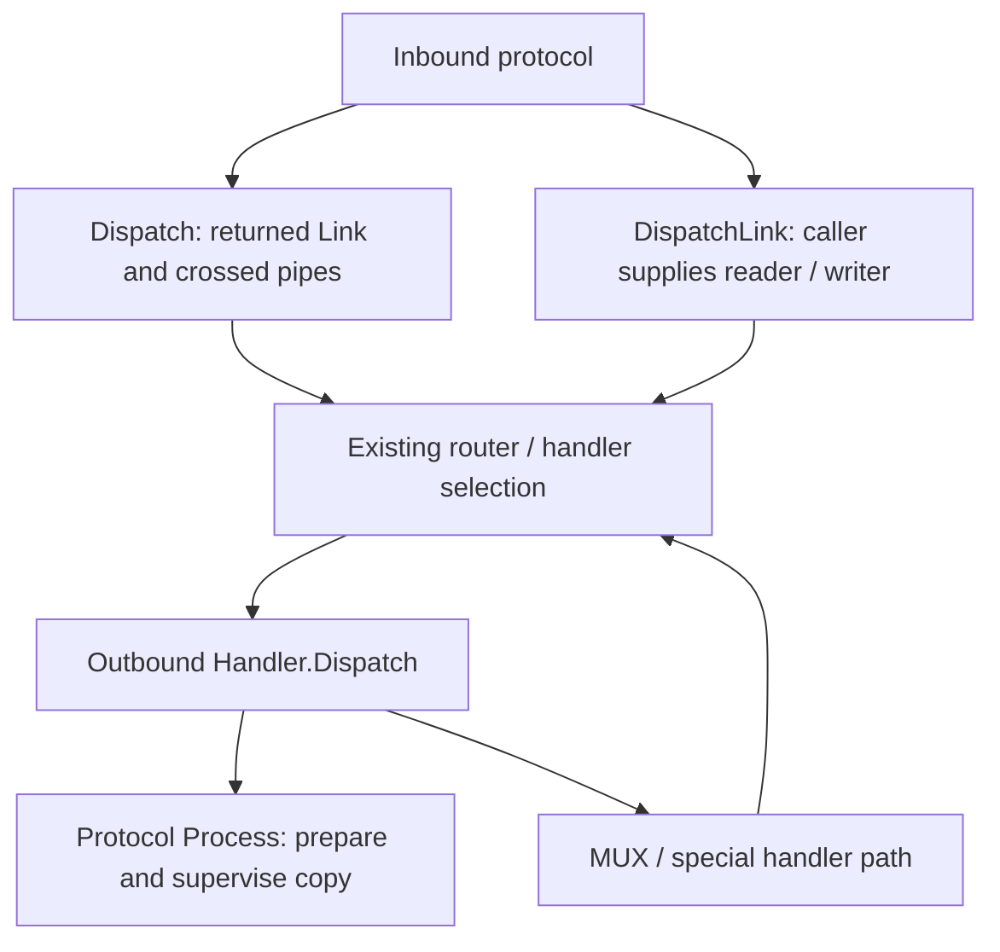

# Execution ownership map

## Status and source boundary

This is a focused map of official base `3519dfec` and this experiment, not a
complete replacement architecture for every Xray entry. Relative code links
refer to this RFC. The as-is source is pinned to the official base.

This is the focused E1 overlay. [CORE_ATLAS.md](CORE_ATLAS.md) preserves the
full source-navigation map at its earlier official pin, with later-base
corrections separated explicitly. It includes special admissions, virtual and
physical connection forms, transport registries, reinjection, counter/fast-path
boundaries and the close-owner table omitted from this short overlay.

## Existing execution

DispatchLink need not allocate the crossed pair. A Link is a reader/writer
handoff, not an independent socket or a universal completion owner.
See official [dispatcher](https://github.com/XTLS/Xray-core/blob/3519dfecbd65022ba71d9bc73e94063d0cbc8636/app/dispatcher/default.go),
[outbound handler](https://github.com/XTLS/Xray-core/blob/3519dfecbd65022ba71d9bc73e94063d0cbc8636/app/proxyman/outbound/handler.go)
and [Link](https://github.com/XTLS/Xray-core/blob/3519dfecbd65022ba71d9bc73e94063d0cbc8636/transport/link.go).

## Experimental stream boundary

1. SOCKS/Trojan parse their protocol and provide decoded operations, retained
   input and the correct resource interruption/close capabilities. They call
   common admission rather than contain a second general relay supervisor.
2. [Dispatcher](../../../app/dispatcher/stream.go) owns retained input through
   sniffing, route selection and preparation. Routing itself stays native.
3. [Proxyman](../../../app/proxyman/outbound/handler.go) invokes protocol-local
   preparation and chooses the supported transfer path. Freedom, Shadowsocks
   and ordinary VLESS retain dialing, protocol startup and framing locally.
4. [Exchange](../../../transport/exchange/stream.go) owns the selected stream's
   bidirectional transfer, policy transitions, abort and worker join. Input
   custody, optional read-ahead and native transfer are separate concrete parts.
5. Endpoint capabilities identify what may be interrupted or closed. They do
   not grant ownership of all underlying shared sockets or carriers.

The optional interfaces in [routing](../../../features/routing/dispatcher.go)
and [outbound](../../../features/outbound/outbound.go) still expose compatibility
projections. No full-core transition is claimed by their existence.

## Association, leg, child and carrier

The [packet dispatcher](../../../app/dispatcher/packet.go) admits a SOCKS
association; its preparation callback runs routing for every new leg using
fresh mutable metadata. [RunPacketAssociation](../../../transport/exchange/packet.go)
owns the source and at most one current leg. Failure/expiry retires that leg;
the next datagram may prepare another. It does not create a destination map.

The executor exclusively owns source writes and their deadline. Retirement
cancels the old generation, interrupts its writes and endpoint, joins its
workers/callbacks, then resets the source deadline before reuse. This capability
is demonstrated on the selected SOCKS source, not on arbitrary virtual devices.

A [native MUX child](../../../common/mux/native_e1.go) owns its logical decoded
stream and bounded input. [The carrier writer](../../../common/mux/carrier_e1.go)
serializes complete frames. Closing one child does not close siblings. Carrier
cancellation can interrupt the physical root to release a stalled writer.
END acknowledgement here means Link-writer acceptance, not remote delivery.

## Retirement ledger

| Existing responsibility | Change in E1 | What still prevents global deletion |
| --- | --- | --- |
| Trojan TCP handleConnection relay/timer body | Physically removed | Separate UDP processing remains |
| SOCKS TCP Link/buf projection | Replaced by decoded admission | HTTP forwarding is separate; baseline SOCKS had no crossed pair here |
| Dispatcher returned-Link crossed pipes | Bypassed on selected native paths | Other Dispatch callers still use getLink |
| Freedom/SS/VLESS Process supervision | Bypassed by selected prepared streams | Old admissions, UDP and special commands still reach Process |
| SOCKS UDP dispatcher body | Replaced by association and replaceable leg | Other packet producers still use the old UDP dispatcher |
| MUX TCP child Dispatch/pipe relay | Bypassed for native children | Carrier Link, packet/XUDP and non-native branches remain |
| Compatibility projections | Native guarded routes avoid them | Custom/unconverted handlers require their own migration |

Remaining callers include other inbound shapes (VMess carrier, SS/SS2022,
VLESS, HTTP, TUN, WireGuard and others), core.Dial/tagged/internal DNS entries,
loopback/reverse and packet/XUDP branches. Process preparation extraction is
code relocation unless its old caller/body is actually removed.

## Completion invariants

- Producer EOF can precede queue drain and final peer write completion.
- Natural completion waits for owned writes; cancellation has a release/join path.
- Child completion does not imply carrier completion.
- Leg completion does not imply association completion.
- Handler return does not prove completion of arbitrary legacy asynchronous work.
- Dial/preparation, transfer and shared-service cancellation have different owners.

Codec buffers and native readv/writev helpers still exist. Linux splice can use
a kernel pipe; that is not the old application-level handoff queue.
