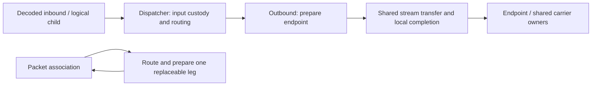

# RFC: decoded endpoint ownership and shared execution in Xray

## Status

Architecture RFC with an executable experiment, **not merge-ready**. This asks
whether the ownership boundaries are useful before splitting production changes.
The experiment (E1, revision R2) starts at official Xray
[`3519dfec`](https://github.com/XTLS/Xray-core/commit/3519dfecbd65022ba71d9bc73e94063d0cbc8636).
It does not select an upstream API or authorize migration of every protocol.

Read [ownership](OWNERSHIP_MAP.md), [validation](VALIDATION.md),
[design decisions](DESIGN_DECISIONS.md), and [migration](MIGRATION.md).

The short proposal is only the entry point. The supporting research is available
in full, with historical and current evidence kept distinct:

- [Full 64-row experiment register and causal history](EXPERIMENT_MATRIX.md),
  with [machine-readable rows, variants, statuses and receipt IDs](historical-matrix.json).
- [Full pinned core atlas](CORE_ATLAS.md): entry points, protocol/transport
  boundaries, packet/MUX/XUDP, reinjection, fast paths and actual close owners;
  later-base corrections are explicit.
- [Detailed E1 results](E1_RESULTS.md): rejected R1 mechanisms, alternatives,
  regression families, allocation/storage measurements, negative results and
  remaining gaps. The aggregate samples are published alongside the tables.
- [Pinned sing-box and Mihomo implementation examples](PEER_EXAMPLES.md),
  including capability/packet/lifetime differences and limits of comparison.

Historical `CONN-R1/CONN-R2` and current `E1 R1/R2` are different series. The
64 research rows are not 64 passing E1 tests; the six current integration cells
are not a substitute for the broader research history.

## Problem and proposal

Decoded input, routing, outbound startup, copy supervision, directional policy,
and completion currently cross several owners. Some callers construct returned
Links and crossed pipes; others already supply decoded readers/writers through
DispatchLink. Outbound Process implementations also supervise transfer. Removing
one relay can change when EOF is observed during a blocked write; passing a new
interface around the same execution does not by itself remove these duties.

The proposal makes protocol parsing/framing local, reuses routing, and gives
preparation and established transfer explicit ownership. Stream, packet
association, and multiplexed child/carrier operations need different mechanics.
One universal Conn type or pump is not the objective.

DispatchLink and decoded endpoints are not opposing ideas. Whether to evolve
that entry or introduce a separate API remains a question. This specimen uses
optional StreamDispatcher/StreamHandler and protocol preparation interfaces so
unconverted shapes remain reachable. These names and signatures are provisional.

## What the code demonstrates

- SOCKS/Freedom and Trojan/Freedom share ordinary stream execution.
- SOCKS/Shadowsocks AEAD and SOCKS/ordinary VLESS exercise framed startup.
- A SOCKS UDP association can retire a failed leg and route the next datagram
  again without closing the association or replaying an ambiguous write.
- Two native VMess MUX TCP children exercise child isolation and carrier-owned
  serialization, including pressure and stalled physical-carrier cancellation.
- Required read-ahead uses explicitly owned reusable chunks. Read EOF remains
  distinct from queue drain and final local write completion.

This is scoped feasibility evidence. The carrier Link, packet/XUDP branches,
compatibility projections and many old Process callers remain. MUX has explicit
experimental limits. Necessary queues remain; no uniform speed or allocation
improvement is claimed. Local completion is not remote application delivery.

## Questions for maintainers

1. Is separating decoded admission, outbound preparation and shared execution
   worth pursuing? Should this extend DispatchLink or use another boundary?
2. Which layer should own concurrent MUX response serialization and child
   completion? Which Reverse/XUDP behavior must constrain the next slice?
3. Does association lifetime separate from a replaceable routed leg fit this
   SOCKS UDP case? Which packet owners require different mechanics?
4. Which direct Process callers and external handler contracts must remain
   supported, and what endpoint/preparation entry should replace them?
5. What complete first production slice would be useful to review separately?

## Scope and non-goals

No connection tracker, product policy, DNS subsystem rewrite, scheduler,
SS2022 migration, full Reverse/XUDP/Vision migration, Android validation or
release is proposed here. S1-S4/P1/M1 are discriminating examples, not a protocol
coverage claim. Useful framing, batching, vector IO and local buffering remain
explicit implementation concerns rather than being removed for their names.

The related PRs in [MIGRATION.md](MIGRATION.md) supply context and counterexamples.
They do not imply maintainer endorsement of this RFC. No comments in those
threads are needed to understand or review this proposal.
